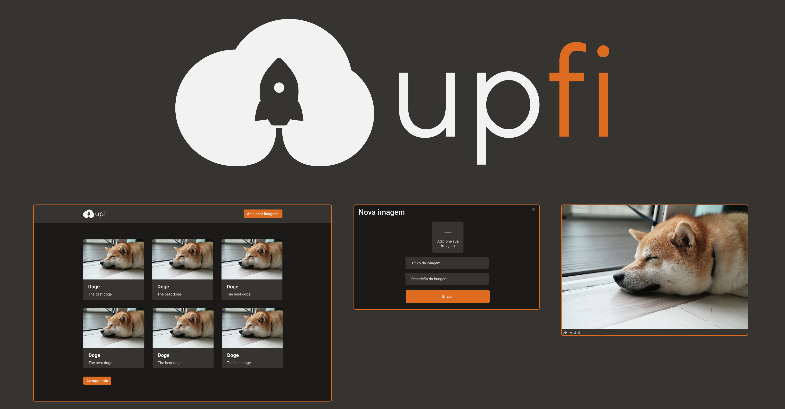

# Ignite - ReactJS
## Upload Images

<p>
  
</p>

> ### [Rocketseat official website](https://www.rocketseat.com.br/)

> [Original challenge template](https://github.com/rocketseat-education/ignite-template-reactjs-upload-de-imagens)

## Technologies used

> - [Next JS](https://nextjs.org/)
> - [Chakra UI](https://chakra-ui.com/)
> - [React Hook Form](https://react-hook-form.com/)
> - [Axios](https://axios-http.com/)
> - [faunadb](https://fauna.com/)
> - [imgbb](https://imgbb.com)

### Prerequisites

### ImgBB

 - [Create an ImgBB account](https://imgbb.com/signup)
 - [Create your API key](https://api.imgbb.com/)
 - Copy the key value and paste it into your `.env.local` as follows:

> > NEXT_PUBLIC_IMGBB_API_KEY=VALUE_OF_KEY_COPIED

#### FaunaDB

Create a collection in [faunadb](https://docs.fauna.com/fauna/current/learn/quick_start/quick_start.html) with the name `images`.
With the database and collection created, just create and copy the database key into your `.env.local` file as follows:

> > FAUNA_API_KEY=VALUE_OF_KEY_COPIED

>>> ### Follow the commands below to run the application:

```
git clone https://github.com/AlanWehrliLC/reactJSigniteChallengeUploadImages.git

cd reactJSigniteChallengeUploadImages

yarn

yarn dev
```

#### What should I edit in the application?

> - pages/index.tsx
> - components/CardList.tsx
> - components/Modal/ViewImage.tsx
> - components/Form/FormAddImage.tsx

#

> ### The idea is that in these 4 files the students have a little contact with the 3 main points covered in this project: React Query, React Hook Form and Chakra UI.

### To start the unit tests just use the command below:

```
yarn test
```